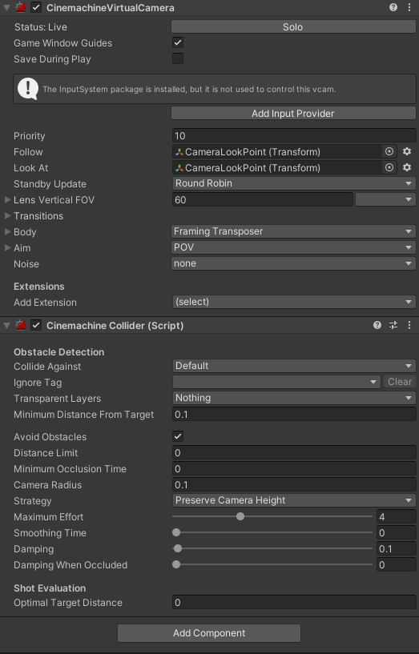

# 2023.10.06 TIL | 시네머신

## 시네머신

### 인스펙터 창

#### CinemachineVirtualCamera
- Prioitry는 카메라의 우선도 (아직 뭔지 모르겠음)
- Standby Update는 사용중이 아닌 시네머신의 업데이트 빈도
( Never 항상 Always 사용중에만 Round Robine 정기적으로 )
- Follow 는 따라다닐 오브젝트를 넣어준다
- Look At은 넣은 오브젝트를 바라봅니다

#### CinemachineCollider
- 카메라가 물체를 안뚫도록 하는법
- Body에서 Obstacles 설정을 하면 IgnoreTag가 아닌 CollideAgainst에 등록된 레이어들과 충돌하여 카메라가 안뚫리게 됩니다.

### 내일 할것

- 오늘 상태머신도 배웠지만 상태머신을 정확하게 이해하지 못하여 상태머신을 이해해볼예정입니다