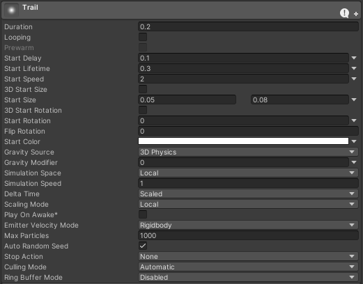
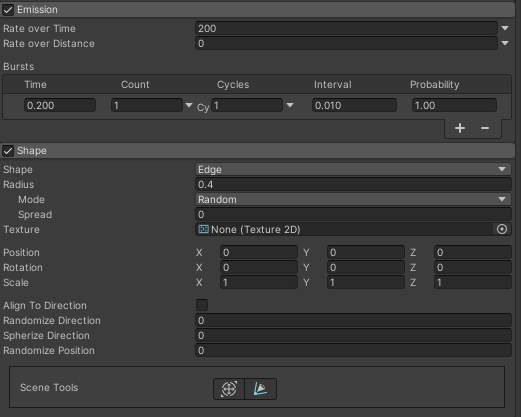
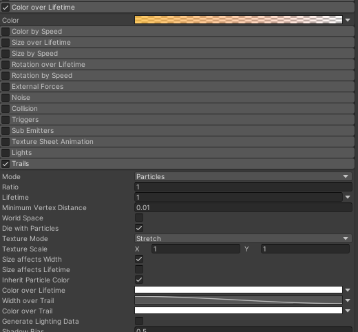

# 2023.10.18 TIL | 팀프로젝트 - 트레일을 사용해 이펙트를 만들자!

[팀프로젝트](https://github.com/tjdgh7419/Chapter3-3_B07_Project)
---

[팀프로젝트 - 1](https://github.com/KimMaYa1/NBC/tree/main/TIL/10%EC%9B%94/20231013%20TIL%20%ED%8C%80%ED%94%84%EB%A1%9C%EC%A0%9D%ED%8A%B8%20%EC%8B%9C%EC%9E%91)
---
[팀프로젝트 - 2](https://github.com/KimMaYa1/NBC/tree/main/TIL/10%EC%9B%94/20231016%20TIL%20%ED%8C%80%ED%94%84%EB%A1%9C%EC%A0%9D%ED%8A%B8%20-%20%EC%B2%B4%EB%A0%A5%EB%B0%94%20%EC%84%9C%EC%84%9C%ED%9E%88%20%EC%A4%84%EC%9D%B4%EA%B8%B0)
---
[팀프로젝트 - 3](https://github.com/KimMaYa1/NBC/tree/main/TIL/10%EC%9B%94/20231017%20TIL%20%ED%8C%80%ED%94%84%EB%A1%9C%EC%A0%9D%ED%8A%B8%20-%ED%99%98%EA%B2%BD%EC%84%A4%EC%A0%95%EC%9D%84%20%EB%B0%94%EA%BF%94%EB%8F%84%20%EC%9C%A0%EC%A7%80%EB%90%98%EB%8F%84%EB%A1%9D!)
---

## 오늘 한 일

### 검기 이펙트를 

- Duration 아마 얼마나 실행할지?
- 딜레이 / 살아있는 시간 / 스피드 / 사이즈 / 로테이션 / 색 을 지정할수있다 (대부분 이정도 사용)

- Emission은 얼마나 소환할지? 주기는 얼마나 할지? 같다
- Shape는 내가 어떤 형태로 나갈지를 정할수있고 어느정도 퍼질지 정해준다

 - 컬러 오버 라이프 타임으로 점점 투명해지게 바꿀수있다
 - Trails를 사용하여 파티클을 늘어지도록 해서 검기 모양으로 만들어준다

### 이외 한것들

- 각종 상황에서 사운드가 나올수있도록 스크립트를 구현 게임오버 UI/기능 전에 만들었던 스크립트들을 동료들과 합치면서 수정을 하였다

### 할것들

- 사실 오늘은 동료 한분이 거즘 하차선언을 하셔서 조금 힘든 날이다
- 그래도 힘내서 남은 퀘스트 / 스킬구현 / 그래픽매니저 / 그래픽매니저를 활용한 이펙트 오브젝트 풀링을 진행할 예정이다.