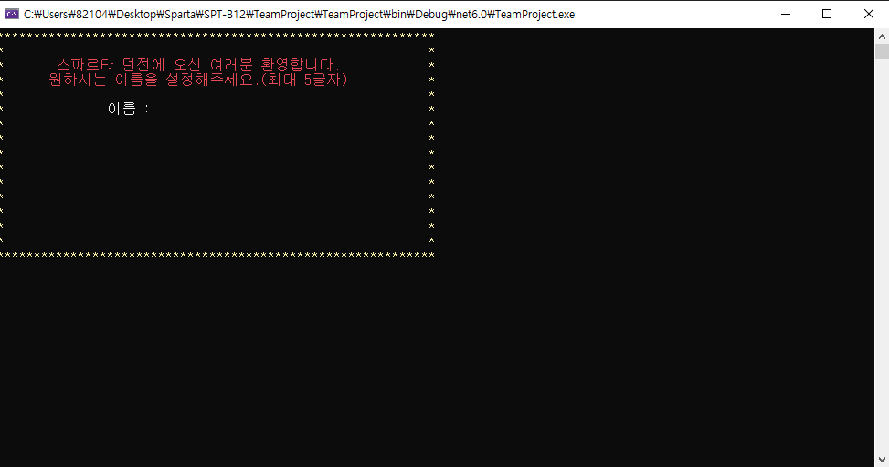

# 내일배움캠프 11일차 TIL | C# 팀과제


<htr>https://github.com/KimMaYa1/SPT-B12

## 팀과제

- 저같은 경우는 팀에서 씬화면을 보여주는 담당자였습니다 아래는 주요 코드들 입니다.
 - 오늘은 콘솔꾸미기를 주로 했는데 콘솔 꾸미기를 하는 과정에서 정보입력 메서드가 지정 범위를 벗어나서 수정해줬습니다

### 콘솔 꾸미기

- 테두리 그려주는 메서드
  ```
  public void DrawStar(int x, int y)
  {
    Console.ForegroundColor = ConsoleColor.Yellow;
    for (int i = 0; i < x; i++)
    {
        Console.SetCursorPosition(i, 0);
        Console.Write("*");
    }
    for (int i = 0; i < y; i++)
    {
        Console.SetCursorPosition(0, i);
        Console.Write("*");
        Console.SetCursorPosition(x - 1, i);
        Console.Write("*");
    }
    for (int i = 0; i < x; i++)
    {
        Console.SetCursorPosition(i, y);
        Console.Write("*");
    }
  }
  ```
 - 위 메서드는 가로 세로 크기를 각각 받아서 테두리를 *로 그려준다

- 커서 지정해서 출력해주는 메서드
  ```
  public void SetCursorString(int lineX, int lineY, string str, bool isNextLine)
  {
    if (isNextLine)
    {
        Console.SetCursorPosition(lineX, lineY);
        Console.Write(str);
    }
    else
    {
        Console.SetCursorPosition(lineX, lineY);
        Console.WriteLine(str);
    }
  }
  ```
 - 테두리를 정하고 나서 콘솔에 출력을 하면 커서가 테두리 밑으로가기때문에 새로운 커서를 지정해줘야하는데 일일이 지정해주는게 힘들어서
   지정할 포지션을 lineX lineY로 받고 문자열을 다음라인으로 넘길지 말지를 isNextLine으로 판단하여 콘솔에 출력하였습니다
   아래 예시 그림처럼 출력됩니다.
   

### 변경된 정보입력창

 - 디스플레이 창에서 대부분의 입력처리메서드가 반복문을 돌면 테두리를 벗어나기때문에 while문을 삭제하고 if문으로 대체하였습니다.
  ```
  public int InputString(int min, int max, int num, string str,int lineX, int lineY)
  {
    SetCursorString(lineX, lineY++,str,false);
    SetCursorString(lineX, lineY++, "      >> ",true);
    string input = Console.ReadLine();
    int inputNum;
    lineY++;
    if (num != 0)
    {
        bool isSelect = int.TryParse(input, out inputNum);

        bool ismon = false;
        int monnum = inputNum - 1;
        if (monnum >= 0 && monnum < _monsters.Length)
        {
            if (_monsters[monnum].Hp <= 0)
                ismon = true;
        }

        if (!isSelect || !(inputNum >= min && inputNum <= max) || ismon)
        {
            Console.ForegroundColor = ConsoleColor.Red;
            SetCursorString(lineX, lineY++, "=====================",false);
            SetCursorString(lineX, lineY++, "  잘못된 대상입니다",false);
            SetCursorString(lineX, lineY++, "=====================",false);
            Thread.Sleep(1000);
            return -1;
        }
    }
    else
    {
        if (!int.TryParse(input, out inputNum) || !(inputNum >= min && inputNum <= max))
        {
            Console.ForegroundColor = ConsoleColor.Red;
            SetCursorString(lineX, lineY++, "=====================", false);
            SetCursorString(lineX, lineY++, "  잘못된 입력입니다", false);
            SetCursorString(lineX, lineY++, "=====================", false);
            Thread.Sleep(1000);
            return -1;
        }
    }
    return inputNum;
  }
  ```
 - 만약 조건을 만족하지 못했다면 -1을 반환하여 호출한 함수에서 -1이면 잘못된 입력으로 처리해 반복하도록 하였습니다
   아래 예시처럼 사용
  ```
  int input = InputString(1, 3, 0, "원하는 직업을 선택해주세요.", lineX-3, lineY);
  if(input == -1)
  {
    return true;
  }
  ```

## TIL을 마치며

- 오늘은 크게 어려운 문제들이 많지 않았지만 콘솔을 꾸미는 과정에서 전에 만들었던 메서드들을 고쳐가는데 어려움을 느꼇습니다
  만약 다음에도 프로젝트 진행시 이런 꾸미기가 있다면 제일 먼저 구성하고 가야 편하게 메서드들을 작성할거 같습니다.