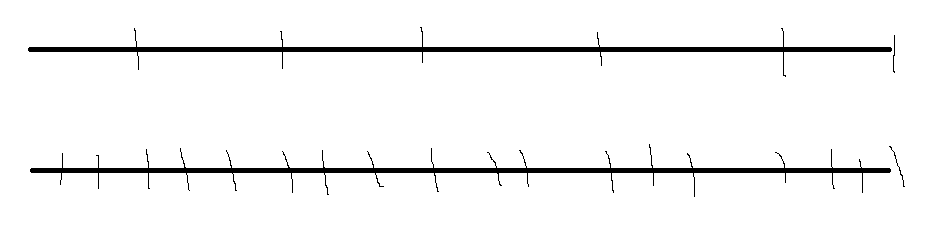
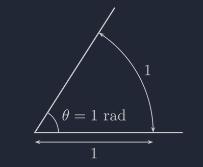

# 내일배움캠프 14일차 TIL | 유니티 입문 - 


## 유니티 강의

### 월드 좌표

  ```
transform.Poistion  //월드 좌표 가져오기

transform.Poistion = new Vector3(1,0,0);  //월드 좌표 변경
  ```
- 프로젝트에서 월드를 중심으로 상대적 위치가 아닌 월드 중심으로 절대적인 위치를 나타내준다

### 로컬 좌표

  ```
transform.localPoistion; //로컬 좌표 가져오기

transform.localPoistion = new Vector3(1,0,0);  //로컬 좌표 변경
  ```
- 프로젝트에서 월드를 중심으로 하는것이 아닌 개별 오브젝트의 위치나 회전으로 부모 - 자식관계의 오브젝트에서 부모와 자식의 상대적 위치를 나타낸다

### Input.GetAxis;

  ```
  float x = Input.GetAxis("Horizontal");
  float y = Input.GetAxis("Vertical");
  
  transform.position += new Vector3(x, y, 0);
  ```
- Input.GetAxis는 입력을 받아 -1과 1사이의 값을 반환해주는 메서드이고 Horizontal Vertical같은 경우는 프로젝트내 설정에서 바궈줄수있다 기본 세팅으로 방향키와 wasd가 되있다

### Time.deltaTime;

  ```
float x = Input.GetAxis("Horizontal");
float y = Input.GetAxis("Vertical");

transform.position += new Vector3(x, y, 0) * Time.deltaTime;
  ```
- Time.deltaTime는 지금프레임과 다음프레임의 시간으로 컴퓨터의 성능에 따라 변하는 값들을 일정하게 다뤄주기 위해서 자주 사용된다 아래는 예시입니다.

위처럼 프레임이 짧을수록 더 많이 이동할수있지만 이동거리에 각 프레임의 시간을 곱해주면 컴퓨터의 성능이 좋지 않더라도 1초동안 움직이는 거리는 일정해집니다.

### normalized

  ```
  Vector2 moveInput = value.Get<Vector2>().normalized;
  ```
- 백터의 x y의 합은 대각선으로 계산될때 더 긴 값을 가지게 되는데 뒤에 normalized를 붙인다면 아무리 긴 값이어도 1로 계산해줍니다

### 만든 메서드

  ```
public void OnLook(InputValue value)
{
    //Debug.Log("OnLook" + value.ToString());
    Vector2 newAim = value.Get<Vector2>();
    Vector2 worldPos = _camera.ScreenToWorldPoint(newAim);
    newAim = (worldPos - (Vector2)transform.position).normalized;

    if (newAim.magnitude >= .9f)
    {
        CallLookEvent(newAim);
    }
}
  ```
- 위 코드에서 내 마우스의 월드좌표를 받아와 나의 좌표의 거리를 계산해 1로 계산해주는 메서드이다


  ```
  private void RotateArm(Vector2 direction)
  {
    float rotZ = Mathf.Atan2(direction.y, direction.x) * Mathf.Rad2Deg;

    armRenderer.flipY = Mathf.Abs(rotZ) > 90f;
    characterRenderer.flipX = armRenderer.flipY;
    armPivot.rotation = Quaternion.Euler(0, 0, rotZ);
  }
  ```
- rotZ가 오일러각도인데 이유가 Atan2 를 사용하여 x y 를 입력해주었다면 0에서 3.14값이 나오고 뒤에 Rad2Deg(1라디안)를 곱하면 0도에서 180도로 만들어줄수있다

- 라디안 값이란 각도 파이(ㅠ)값에 라디안을 곱하면 180이나오게된다 인데 호의 길이가 반지름의 길이가 같다면 1라디안이라고 말한다

- 디그리는 평상시에 활용되는 각도로 0도에서 360도로 표현하는 값이다