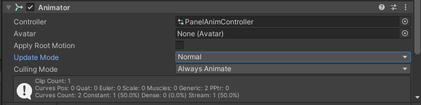
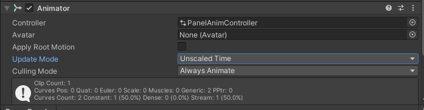

# 내일배움캠프 19일차 TIL | 타임스케일 적용시 일어나는 문제들은?!


## 팀과제 링크
<htr>https://github.com/phw97123/B10_DreamsComeTrue

# 오늘 구현하고 추가된 메서드 & 알게된 메서드

## 1. 패널 애니메이션

### 문제
- 타임스케일을 0으로 바꾸고 애니메이션을 진행할때 애니메이션이 작동하지 않았습니다
- - -
### 해결방안


- 위처럼 업데이트 모드를 UnscaledTime으로 바꾸니 애니메이션이 타임스케일에 방해받지않고 잘 작동하였습니다.

## 2. 텍스트 한개씩 출력

### 문제 (버그가 나는 코드)
  ```
  public class TextTyping : MonoBehaviour
  {
    public List<string> str;
    private Text typingText;
    private float time;
    private int num;
    private int count;
    private string inputStr;
    private bool isStartTyping;

    public void Awake()
    {
        time = 0;
        typingText = GetComponent<Text>();
        isStartTyping = false;
        num = PlayerPrefs.GetInt("CharacterNumber");
        inputStr = str[num];
        count = 0;
    }
    void Update()
    {
        if (count < inputStr.Length && PlayerController.IsDead)
        {
            time += Time.deltaTime;
        }
        else if (isStartTyping)
        {
            OnDeadAudio(PlayerPrefs.GetInt("CharacterNumber"));
            isStartTyping = false;
        }
        if (time > 1.4f && PlayerController.IsDead)
        {
            isStartTyping = true;
            AudioManager.Instance.PlaySfx(AudioManager.Sfx.Typing);
        }
        if (time > 0.1f && PlayerController.IsDead && isStartTyping)
        {
            textPrint();
            time = 0;
        }
    }

    private void OnDeadAudio(int num)
    {
        Debug.Log(num);
        switch (num)
        {
            case 0:
                AudioManager.Instance.PlaySfx(AudioManager.Sfx.PS5);
                break;
            case 1:
                AudioManager.Instance.PlaySfx(AudioManager.Sfx.FIFA);
                break;
            case 2:
                AudioManager.Instance.PlaySfx(AudioManager.Sfx.Wine);
                break;
            case 3:
                AudioManager.Instance.PlaySfx(AudioManager.Sfx.SleepSound);
                break;
        }
    }

    void textPrint()
    {
        typingText.text += inputStr[count];
        count++;
    }
  }
  ```
- 해당 클래스에서 구현하려했던것들은 패널이 떨어지고 난후 텍스트가 한자씩 찍히도록 하고 타이핑 사운드를 내게하려했는데 떨어지는 애니메이션이 진행이 되지만 텍스트가 찍히지 않음
- - -
### 해결방안
  ```
    if (count < inputStr.Length && PlayerController.IsDead)
  {
    time += Time.unscaledDeltaTime;
  }
  ```
- 게임이 끝났을때 타임 스케일을 0으로 지정해주었기 때문에 시간이 흐르지 않아 Time.deltaTime이 더해지지 않아 타임스케일이 0이어도 값이 더해질수있게 unscaledDeltaTime을 사용하여 버그를 해결하였습니다.

## 향후 개발 & 알고 싶은 것들

- 밸런스 패치를 진행하면 이번 팀프로젝트는 끝날거같습니다.
- 내일은 싱글톤에 대해 알아볼거 같습니다