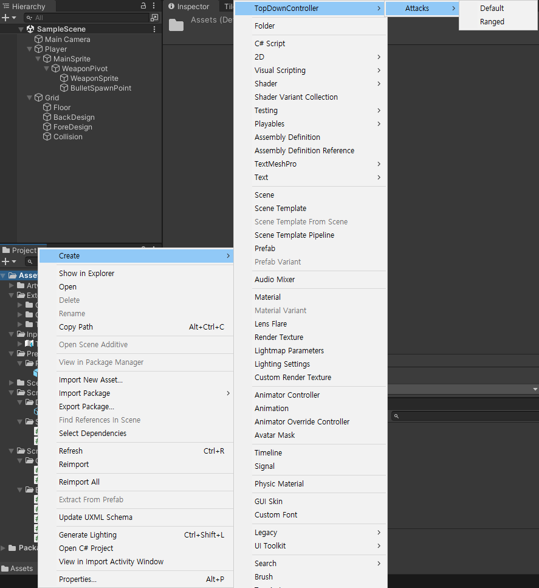
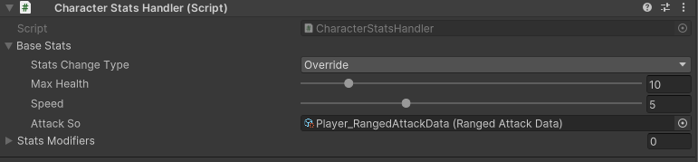

# 내일배움캠프 21일차 TIL |  스크립터블 오브젝트란?


### 

## 스크립터블 오브젝트란?

- 대량의 데이터를 저장하여 사용할수 있는 데이터 컨테이너
- 변경되지 않는 데이터를 사용하는 프리팹의 데이터를 일반 변수로 구현할 경우 인스턴스화 할때마다 메모리 소모가 많아진다
- 메모리에 스크립터블 오브젝트의 데이터의 사본만을 저장하고 참조하는 방식이기 때문에 메모리 소모가 줄어든다
- 모노비헤이비어와 같이 기본 유니티 프로젝트에서 파생된다
- 게임오브젝트에 컴포넌트로 부착시킬수 없다

## 스크립터블 오브젝트의 생성방법

  ```
  using System.Collections;
  using System.Collections.Generic;
  using UnityEngine;
                  //fileName = 파일 이름     menuName = 메뉴 이름          order = 메뉴에서 어디에 표시할지
  [CreateAssetMenu(fileName ="DefaultAttackData", menuName ="TopDownController/Attacks/Default", order = 0)]

  public class AttackSo : ScriptableObject
  {
    [Header("Attack Info")]
    public float size;
    public float delay;
    public float power;
    public float speed;
    public LayerMask target;

    [Header("Knock back info")]
    public bool isOnKnockback;
    public float knockbackPower;
    public float knockbackTime;
  }
  ```
  - 에셋내에 생성할때 order를 0으로 설정해두어 최상단에 넣어졌습니다.
  - [참고자료]
  

## 스크립터블 사용하기

### 캐릭터스텟
  ```
  using System;
  using System.Collections;
  using System.Collections.Generic;
  using UnityEngine;
  
  public enum StatsChangeType
  {
    Add,
    Multiple,
    Override,
  }

  [Serializable]

  public class CharacterStats
  {
    public StatsChangeType statsChangeType;
    [Range(1, 100)] public int maxHealth;
    [Range(1f, 20f)] public float speed;

    public AttackSo attackSo;
  }
  ```
- 열거형으로 타입마다 숫자를 매겨줍니다
- 모노비헤이비어를 상속하지 않기때문에 유니티 컴포넌트에 부착할수가 없다
- 밑에서 나올 CharacterStatsHandler로 캐릭터스텟을 관리할거기 때문에 최소한의 데이터만 입력합니다
- [Serializable]를 사용하여 CharacterStatsHandler를 컴포넌트에 부착할때 baseStats를 보이도록 해줍니다
- public AttackSo attackSo; 부분은 컴포넌트에 부착됬을때 스크립터블 오브젝트를 할당해주는 변수선업입니다
- [참고자료]

### 캐릭터스텟핸들러

  ```
  public class CharacterStatsHandler : MonoBehaviour
  {
    [SerializeField] private CharacterStats baseStats;

    public CharacterStats CurrentStates { get; private set; }
    public List<CharacterStats> statsModifiers = new List<CharacterStats>();

    private void Awake()
    {
        UpdateCharacterStats();
    }

    private void UpdateCharacterStats()
    {
        AttackSo attackSo = null;
        if(baseStats.attackSo != null)
        {
            attackSo = Instantiate(baseStats.attackSo);
        }

        //생성하면서 초기화를 위해 {}사용
        CurrentStates = new CharacterStats { attackSo = attackSo };
        //해당 부분 밑으로는 임시 생성
        CurrentStates.statsChangeType = baseStats.statsChangeType;
        CurrentStates.maxHealth = baseStats.maxHealth;
        CurrentStates.speed = baseStats.speed;
    }
  }
  ```
  
- 캐릭터 스텟을 각 객체마다 설정해주기 위해 baseStats을 선언해줍니다
- 컴포넌트에 할당된 스크립터블 오브젝트가 있다면 복제해서 사용합니다
- 복제해서 사용한 이유는 다른 오브젝트에 간섭하지 않고 스텟을 수정하고싶어서 사용

## 향후 알고 싶은 것들

- 