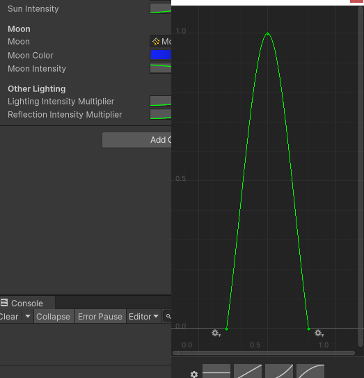
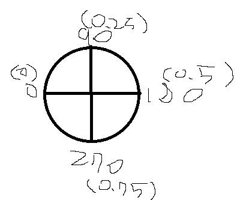

# 내일배움캠프 25일차 TIL |  스크립터블오브젝트,프리팹 뭘 써야할까? & 해와달구현


### [개인프로젝트 경로](https://github.com/KimMaYa1/SpartaProject)

## 스크립터블 오브젝트와 프리팹

- 제가 만난 오류는 아니지만 다른분이 만난 오류를 듣다보니 생각하게되었는데 만약 내가 장착해야할 아이템이 고유 아이템이 아니라면 장착여부를 어디에 넣어야할까 라는 고민을 하게되었다
- 스크립터블 오브젝트를 사용하게 된다면 아이템의 능력치를 설정하고 관리하기 편해집니다
- 그렇지만 여러개의 아이템이 인벤토리에 있다면 스크립터블 오브젝트의 장착상태가 변하기떄문에 프리팹으로 두는게 좋을거같다고 생각됩니다.
- 이문제는 나중에 프로젝트를 진행하게 된다면 구현해봐야할거같아요.

## 밤낮 구현

- 문제점 없음

  ```
  using UnityEngine;

  public class DayNightCycle : MonoBehaviour
  {
    [Range(0f, 1f)]
    public float time;
    public float fullDayLength;
    public float startTime = 0.4f;
    private float timeRate;
    public Vector3 noon;

    [Header("Sun")]
    public Light sun;
    public Gradient sunColor;
    public AnimationCurve sunIntensity;

    [Header("Moon")]
    public Light moon;
    public Gradient moonColor;
    public AnimationCurve moonIntensity;

    [Header("Other Lighting")]
    public AnimationCurve lightingIntensityMultiplier;
    public AnimationCurve reflectionIntensityMultiplier;

    private void Start()
    {
        timeRate = 1.0f / fullDayLength;
        time = startTime;
    }

    private void Update()
    {
        time = (time + timeRate * Time.deltaTime) % 1.0f;

        UpdateLighting(sun, sunColor, sunIntensity);
        UpdateLighting(moon, moonColor, moonIntensity);

        //환경에서 받아오는 값
        RenderSettings.ambientIntensity = lightingIntensityMultiplier.Evaluate(time);
        RenderSettings.reflectionIntensity = reflectionIntensityMultiplier.Evaluate(time);
    }

    //애니메이션 커브에 시간값을 주면 그시간에 맞는 그래프(각도)를 가져옴
    void UpdateLighting(Light lightSource, Gradient colorGradiant, AnimationCurve intensityCurve)
    {
        float intensity = intensityCurve.Evaluate(time);

        //noon = 90도 하루는 360도이기떄문에 4를 곱함
        //라이트소스가 해라면 0.25만큼 날이 지난거기때문에 0.25 달이면 0.75
        lightSource.transform.eulerAngles = (time - (lightSource == sun ? 0.25f : 0.75f)) * noon * 4.0f;
        lightSource.color = colorGradiant.Evaluate(time);
        lightSource.intensity = intensity;

        GameObject go = lightSource.gameObject;
        if(lightSource.intensity == 0 && go.activeInHierarchy)
            go.SetActive(false);
        else if(lightSource.intensity > 0 && !go.activeInHierarchy)
            go.SetActive(true);
    }
  }
  ```

- AnimationCurve 같은 경우는 인스펙터에서 커브를 아래그림처럼 설정할수있게 해주고 이값을 시간값에 주어서 빛의 각도를 조절한다



### 환경값 조정

  ```
  RenderSettings.ambientIntensity = lightingIntensityMultiplier.Evaluate(time);
  RenderSettings.reflectionIntensity = reflectionIntensityMultiplier.Evaluate(time);
  ```
- RenderSettings을 환경광과 반사광값에 애니메이션 커브값을 주어서 빛을 강하고 약하게 준다

### 해와 달의 시간별 구현 & 각도 조절

  ```
  lightSource.transform.eulerAngles = (time - (lightSource == sun ? 0.25f : 0.75f)) * noon * 4.0f;
  ```
- 하루를 1을 기준으로 나눈다고 생각하자
- noon은 90도로 설정하였고 하루를 설정할때 아래처럼 한바퀴를 도는거처럼 해석하자면 360도를 돌아야 하기때문에 4를 곱해줍니다.
- 이후 만약 지금 라이트소스가 해라면 해의 중간에 속한 0.25를 주고 달이라면 0.75를 준다
- 업데이트에서 time값을 업데이트로 계속해서 지정하기떄문에 라이트의 앵글을 계속해서 바꿔준다
